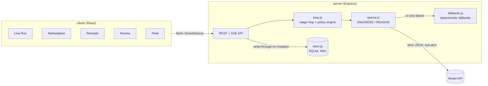
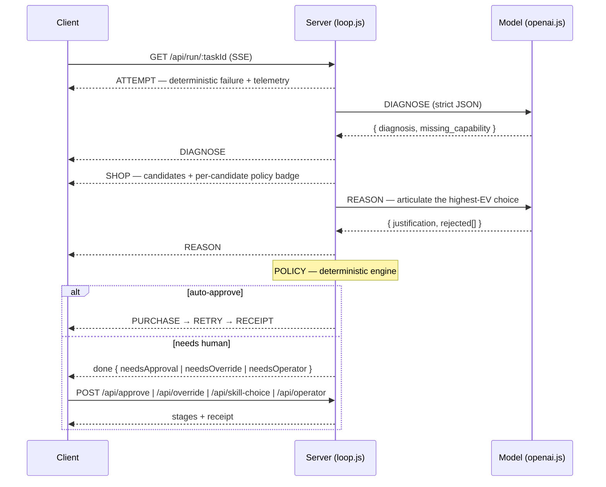

# Architecture

SkillCard is two processes in one repository: a **React client** (Vite + Tailwind) and an
**Express server** that owns all state and all governance decisions. The client is a thin
view; nothing that authorizes spend runs in the browser.

## The run loop

`GET /api/run/:taskId` streams eight stages over Server-Sent Events. The model is only
ever asked to *explain*; every decision that moves money is deterministic code.

## The policy engine

`applyPolicy(skill, robot)` in `server/loop.js` evaluates, in order:

1. **Blocked category** (e.g. teleop for autonomous units) → hard block
2. **Missing hardware** → hard block
3. **Unverified vendor** → hard block
4. **Unrestricted permissions** requested → hard block
5. **Missing certification** → hard block
6. **Over the auto-approve ceiling** → flag for human approval
7. Otherwise → auto-approve

Hard blocks fall back to the next-best candidate by expected value. If the surviving
choice exceeds the robot's **remaining budget**, the run pauses for an explicit human
**budget override**. Every human decision (approve / different skill / override /
operator escalation) resumes server-side through its own endpoint and lands on the same
auditable receipt.

## State & persistence

The server keeps its working state in memory and **write-throughs to SQLite**
(`better-sqlite3`, WAL mode) on every mutation; boot rehydrates from the database.
Entities (`robots`, `tasks`, `marketplace`, `receipts`) are real tables — nested
structures (policies, histories, receipt bodies) are JSON columns. A `generation`
counter guards against a reset racing an in-flight run: a run started before a reset
is discarded rather than re-applied.

Transient decision context (`pendingApprovals`, `pendingEscalations`) is deliberately
**not** persisted — a restart legitimately drops half-finished approvals.

## Reliability rules

- **The model proposes, policy disposes.** Model output never authorizes spend.
- **Every external call falls back.** Both model calls are strict-JSON with deterministic
  fallbacks; the UI never sees a raw error (JSON 4xx/5xx everywhere, an error boundary
  client-side, auto-retry when the server is unreachable).
- **Deterministic under `RUN_STUBBED=1`** — the whole loop runs without a key, which is
  what the test suite and CI rely on.
